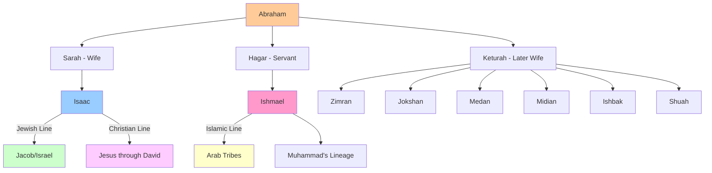

# Genealogy Diagrams

## Abraham's Family Tree - The Source of Division

## The Biblical Genealogies - Matthew vs Luke

*[This will include our detailed genealogy diagram from earlier showing the different lineages to Jesus]*

## Key Insights from the Family Tree

1. **Common Origin**: All three major monotheistic religions trace back to Abraham
2. **The Split**: Isaac (West) vs. Ishmael (East) becomes Judaism/Christianity vs. Islam
3. **Forgotten Branches**: Abraham had 6 other sons who became various tribal groups
4. **Geographic Distribution**: Family dynamics literally shaped world geography
5. **Theological Implications**: Same family, same God, different interpretations